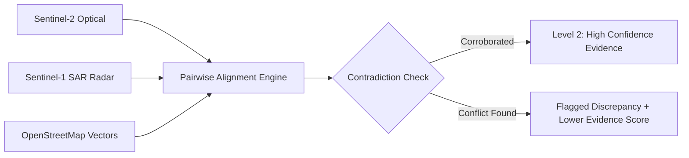

# ORBIT
### Geospatial Intelligence & Earth Monitoring Platform

[](./backend/tests)
[](./frontend/src/tests)
[](./frontend)
[](https://fastapi.tiangolo.com)
[](https://postgis.net)
[](https://maplibre.org)
[](https://www.python.org)
[](https://react.dev)
[](https://www.typescriptlang.org)

ORBIT is a local-first geospatial intelligence and Earth observation platform designed for deterministic environmental monitoring, multi-temporal change detection, and verifiable AI decision support. By combining multi-spectral optical satellite imagery (Copernicus Sentinel-2, Landsat-8/9), all-weather synthetic aperture radar (Copernicus Sentinel-1 SAR C-band), and OpenStreetMap vector road infrastructure with PostgreSQL/PostGIS spatial analytics, ORBIT automates the detection of land-use transitions—such as illegal deforestation, water body desiccation, and urban expansion—while enforcing cryptographic provenance and strict anti-hallucination guardrails across all generated intelligence dossiers.

---

## 1. Overview

Satellite Earth Observation generates terabytes of raw telemetry daily, yet transforming pixel grids into trustworthy, auditable intelligence remains challenging. Common industry pitfalls include unconstrained AI hallucinations, unverified single-sensor false positives (e.g., cloud shadows mistaken for clear-cut land), and opaque algorithmic pipelines.

ORBIT solves these challenges through:
1. **Multi-Source Sensor Fusion**: Concurrently evaluating optical multi-spectral reflectance, microwave radar backscatter, and road vector topology.
2. **Epistemic Invariance**: Enforcing hard boundaries between observed telemetry, computed spatial metrics, statistical forecasts, and AI summaries.
3. **Reproducible Provenance**: Attaching immutable SHA-256 digital seals to intermediate evidence graphs and final intelligence briefings.

---

## 2. Why ORBIT

- **Deterministic Science Over Generative Speculation**: Every claim generated by the platform must resolve to an immutable evidence identifier computed from calibrated satellite pixels.
- **Cross-Sensor Corroboration**: Optical vegetation index drops are corroborated against cloud-penetrating SAR radar roughness to eliminate atmospheric false alarms without consensus averaging.
- **Local-First & Defense-in-Depth**: Engineered to run in self-hosted or air-gapped environments with full SSRF protection, path traversal jails, and memory-bounded raster windowing.

---

## 3. Core Capabilities

- **Interactive MapLibre Geospatial Workstation**: WebGL-accelerated 2D mapping canvas with real-time WGS84 geodesic coordinate tracking, MapTiler Cloud basemaps, and OpenStreetMap vector road layers.
- **PostgreSQL / PostGIS Spatial Intelligence**: 7 dedicated relational schemas (`auth`, `workspace`, `geo`, `eo`, `analysis`, `intelligence`, `history_deep`) utilizing spatial GiST indices and ellipsoid geodesic calculations (`ST_Area(geog, true)`).
- **Sub-Pixel Spectral Processing Engine**: Memory-efficient windowed Cloud-Optimized GeoTIFF (COG) reads computing:
  - **NDVI** (Normalized Difference Vegetation Index) for canopy health and biomass tracking.
  - **NDWI** (Normalized Difference Water Index) for water body delineation and recession analysis.
  - **NDBI** (Normalized Difference Built-up Index) for impervious surface and urban construction detection.
  - **SAVI** (Soil-Adjusted Vegetation Index, $L=0.5$) for arid and semi-arid terrain.
- **Multi-Temporal Trajectory & Persistence**: Sequential $T_1 \to T_2 \to \dots \to T_n$ change series, directional persistence quantification, and recovery rebound analysis.
- **Forward-Looking Time-Series Forecasting**: Trend regression and harmonic decomposition over historical baselines with $\pm 95\%$ confidence interval envelopes ($p < 0.01$).
- **Live STAC Scene Discovery & Ranking**: Direct querying of the AWS Earth Search STAC API with deterministic multi-criteria ranking (cloud coverage, GSD, spatial IoU).
- **Pre-Analytical Raster Validation**: Fast GeoTIFF header verification validating TIFF magic bytes, CRS non-degeneracy, affine transform integrity, and SHA-256 asset checksums.
- **Cross-Sensor Contradiction Engine**: Identifies conflicting sensor telemetry (e.g., optical reflectance drop contradicted by high SAR structural backscatter) and records discrepancies transparently.
- **Grounded AI Intelligence Reasoner**: Generates publication-ready intelligence dossiers where every claim links directly to underlying deterministic evidence records.
- **Cryptographic Provenance**: Immutable SHA-256 digital fingerprinting of all inputs, intermediate calculations, and final output dossiers.
- **Multi-Format Export Engine**: Interactive on-screen dossier reader, printable HTML/PDF generation with embedded print styling, and structured Markdown export.

---

## 4. System Architecture

ORBIT enforces strict architectural separation between user interaction, API routing, asynchronous task execution, analytical processing, and spatial storage:

```
User (Analyst / Executive)
         │
         ▼
React 18 + TypeScript + Vite Workstation ───► MapLibre GL JS 4.7 (MapTiler / OSM Tiles)
         │
         ▼ (REST API / JSON Envelopes)
FastAPI API Gateway (Python 3.11+) ──────────► Security Hardening (SSRF Guard, Path Jail)
         │
         ├──► EO / STAC Ingestion Engine (AWS Earth Search)
         ├──► Raster Processing & Windowed COG Reader (Rasterio / GDAL)
         ├──► Spectral Band Math Engine (NDVI, NDWI, NDBI, SAVI)
         ├──► Change Detection & Trajectory Persistence Engine
         ├──► Time-Series Forecasting & Uncertainty Engine
         ├──► Multi-Source EO Fusion & Contradiction Engine
         └──► Grounded AI Reasoner & Validation Gate
         │
         ├──► Celery 5.3 Task Queue <───► Redis 7.2 Broker & Tile Cache
         │
         ▼ (SQLAlchemy 2.0 Async / GeoAlchemy2)
PostgreSQL 16 + PostGIS 3.4 Spatial Database (WGS84 Geodesics)
```

For the complete architectural design and layer decomposition, see [ORBIT Architecture Documentation](./docs/architecture/ORBIT_ARCHITECTURE.md).

---

## 5. Intelligence Pipeline & Epistemic Hierarchy

ORBIT organizes all data and analytical operations across an inviolable **Epistemic Ladder**:

```
[ LEVEL 4: AI_INTERPRETED ]
  └── Grounded LLM reasoning, claim-by-claim evidence citations, uncertainty statements.
      STRICT INVARIANT: Can NEVER upgrade findings to OBSERVED or CALCULATED.
[ LEVEL 3: PREDICTED ]
  └── Statistical forecasting (trend, harmonic decomposition) with 95% confidence bounds.
[ LEVEL 2: DETECTED ]
  └── Multi-sensor corroboration, cross-sensor contradiction detection, DBSCAN spatial clusters.
[ LEVEL 1: CALCULATED ]
  └── Deterministic spectral indices (NDVI, NDWI, NDBI), pairwise trajectories, PostGIS geodesic metrics.
[ LEVEL 0: OBSERVED ]
  └── Raw sensor telemetry (Sentinel-1 SAR, Sentinel-2 Optical, Landsat-8/9) and OSM vector geometries.
```

---

## 6. Earth Observation & Geospatial Processing

ORBIT's raster engine reads remote sensing assets via Cloud-Optimized GeoTIFF (COG) HTTP range requests:
- **Spatial Resolution Matching**: Automatic resampling and Ground Sample Distance (GSD) alignment across multi-sensor pairs (e.g., 10m Sentinel-2 with 10m Sentinel-1 SAR and 30m Landsat-8).
- **Masking Pipeline**: Dynamic filtering of cloud confidence masks, shadow flags, and NoData boundary pixels before band mathematics.
- **Geodesic Accuracy**: All spatial polygon measurements are calculated on the WGS84 spheroid (`ST_Area(geog, true)`) rather than planar approximations, ensuring sub-meter area precision across all latitudes.

---

## 7. Multi-Source Intelligence & Sensor Fusion



- **Optical Reflectance**: Captures photosynthetic canopy health, chlorophyll absorption, and surface color shifts.
- **SAR Microwave Backscatter**: All-weather C-band radar signals penetrate clouds and smoke, bouncing off physical tree trunks and structural elements to verify ground clearance.
- **Infrastructure Proximity**: Calculates geodesic buffer zones ($< 2.5\text{ km}$) along road networks to isolate human access-driven disturbances from natural anomalies.

---

## 8. AI Intelligence Layer & Zero-Fabrication Policy

The Grounded AI synthesis module operates under strict integrity constraints:
1. **No Uncited Claims**: Every factual statement in generated summaries must link to a deterministic evidence reference ID.
2. **Automated Validation Gate**: If any generated sentence cannot be mathematically traced to an underlying evidence record, the report is rejected before presentation.
3. **Explicit Uncertainty Disclosure**: Statistical confidence percentages and error bounds are highlighted prominently in both executive and technical briefings.

---

## 9. Security & Data Integrity

- **SSRF Protection**: External network requests are restricted to public HTTP/HTTPS endpoints; internal loopback (`127.0.0.0/8`), RFC 1918 private subnets, and cloud metadata services (`169.254.169.254`) are blocked at the socket level.
- **Path Traversal Defense**: All file read operations enforce strict project jail boundaries.
- **Decompression Bomb Defense**: Bounded memory limits (maximum 256 MB per read, $16,384 \times 16,384$ maximum raster dimensions).
- **Credential Redaction**: Automatic scrubbing of authorization tokens, database connection strings, and passwords in all log events and API error envelopes.
- **SHA-256 Checksum Verification**: Every ingested asset and analytical dossier is cryptographically hashed for auditability.

---

## 10. Technology Stack

| Component | Technologies |
| :--- | :--- |
| **Backend API** | Python 3.11+, FastAPI 0.110+, Pydantic v2, Uvicorn |
| **Spatial Database** | PostgreSQL 16, PostGIS 3.4, SQLAlchemy 2.0 (Async), GeoAlchemy2, Alembic |
| **Raster & Vector Analytics** | Rasterio, GDAL 3.8+, NumPy, Shapely 2.0+, SciPy |
| **Task Queue & Cache** | Celery 5.3, Redis 7.2 |
| **Frontend Workstation** | React 18, TypeScript 5.2, Vite 5.1, Tailwind CSS 3.4, Lucide Icons |
| **Mapping Engine** | MapLibre GL JS 4.7, MapTiler Cloud, OpenStreetMap Vector Tiles |
| **Testing Frameworks** | Pytest 8.0, Pytest-Asyncio, Node.js Native Test Runner (`node:test`) |

---

## 11. Project Structure

```
ORBIT/
├── backend/                         # FastAPI backend service
│   ├── alembic/                     # Database migration revisions (0001–0010)
│   │   └── versions/                # 10 sequential transactional migrations
│   ├── app/                         # Core backend application package
│   │   ├── api/                     # REST API endpoints & route handlers
│   │   ├── celery_app/              # Celery background task definitions
│   │   ├── core/                    # Config, security hardening, database engine
│   │   ├── models/                  # SQLAlchemy ORM database models
│   │   ├── schemas/                 # Pydantic request/response schemas
│   │   └── services/                # Intelligence, raster, fusion, & AI services
│   ├── pyproject.toml               # Python project configuration & pytest settings
│   ├── requirements.txt             # Core production dependencies
│   ├── requirements-dev.txt         # Development & testing dependencies
│   └── tests/                       # 205 automated backend unit & integration tests
├── frontend/                        # React 18 + Vite workstation frontend
│   ├── src/
│   │   ├── components/              # Map workstation, AI modal, and UI components
│   │   ├── map/                     # MapLibre styles, layers, sources, & utilities
│   │   ├── pages/                   # Analyses, Evidence, Predictions, Reports, etc.
│   │   ├── services/                # API client services
│   │   ├── tests/                   # 56 automated frontend domain invariant tests
│   │   ├── types/                   # TypeScript interfaces & domain types
│   │   └── utils/                   # Report PDF generator & coordinate helpers
│   ├── package.json                 # Node dependencies & test scripts
│   ├── tsconfig.json                # TypeScript compiler configuration
│   └── vite.config.ts               # Vite bundler configuration
├── docs/                            # 37+ specialized technical engineering guides
│   ├── architecture/                # System architecture diagrams & specifications
│   │   └── ORBIT_ARCHITECTURE.md    # Master architecture diagram & layer documentation
│   ├── DATA_SOURCES.md              # Authoritative satellite data sources & licenses
│   ├── PROJECT_EVOLUTION.md         # Completed phase-by-phase development evolution
│   └── security.md                  # Security model & defensive hardening
├── infra/                           # Infrastructure configurations
├── .env.example                     # Environment template with MapTiler configuration
├── .gitignore                       # Git ignore rules (strictly excludes .env)
├── docker-compose.yml               # PostgreSQL/PostGIS & Redis container configuration
└── README.md                        # Primary project documentation
```

---

## 12. Local Development (Windows PowerShell)

### Prerequisites

| Tool | Minimum Version | Check Command |
| :--- | :--- | :--- |
| **Python** | 3.11+ | `py --version` |
| **Node.js** | 18.0+ | `node --version` |
| **PostgreSQL + PostGIS** | Postgres 15+ / PostGIS 3.3+ | `psql --version` *(or use Docker)* |
| **Docker & Compose** | Docker 24+ *(Optional if running local Postgres)* | `docker compose version` |

---

### Step-by-Step Setup

#### 1. Clone & Configure Environment
```powershell
# In repository root
Copy-Item .env.example .env
```

Open `.env` and set your optional MapTiler API key:
```ini
VITE_MAPTILER_API_KEY=your_maptiler_api_key_here
```
*(If no key is provided, ORBIT automatically falls back to OpenStreetMap cartography without crashing.)*

#### 2. Start Infrastructure (PostgreSQL/PostGIS & Redis)
```powershell
# Option A: Using Docker Compose
docker compose up -d

# Option B: Using a native local PostgreSQL instance
# Ensure database 'orbit_db' is created with PostGIS extension enabled
```

#### 3. Start Backend Service
```powershell
cd backend
py -m venv venv
.\venv\Scripts\Activate.ps1
pip install -r requirements-dev.txt

# Run database migrations
py -m alembic upgrade head

# Launch FastAPI development server
py -m uvicorn app.main:app --reload --host 127.0.0.1 --port 8000
```
- **API Documentation**: `http://127.0.0.1:8000/docs`
- **Health Endpoint**: `http://127.0.0.1:8000/api/v1/health`

#### 4. Start Celery Background Worker *(Optional / In a new terminal)*
```powershell
cd backend
.\venv\Scripts\Activate.ps1
celery -A app.celery_app.celery_app worker --loglevel=info --pool=solo
```

#### 5. Start Frontend Workstation *(In a new terminal)*
```powershell
cd frontend
npm install
npm run dev
```
- **Workstation UI**: `http://127.0.0.1:5173/`

---

## 13. Environment Configuration

All configurable environment variables are documented in `.env.example`:

| Variable | Description | Default / Example |
| :--- | :--- | :--- |
| `POSTGRES_SERVER` | PostgreSQL host | `127.0.0.1` |
| `POSTGRES_PORT` | PostgreSQL port | `5432` |
| `POSTGRES_DB` | Database name | `orbit_db` |
| `POSTGRES_USER` | Database user | `orbit_user` |
| `POSTGRES_PASSWORD` | Database password | `orbit_password` |
| `REDIS_URL` | Redis cache & broker URL | `redis://127.0.0.1:6379/0` |
| `VITE_MAPTILER_API_KEY` | MapTiler API Key for basemaps | `your_key_here` |

> [!IMPORTANT]
> **NEVER commit the real `.env` file or API keys to version control.** The `.gitignore` file is strictly configured to exclude `.env` and all credential artifacts.

---

## 14. Testing & Verification

ORBIT maintains high test coverage across both backend and frontend codebases:

```powershell
# 1. Execute Backend Pytest Suite (205 tests)
cd backend
py -m pytest -v

# 2. Execute Frontend Invariant Suite (56 tests)
cd ../frontend
npm test

# 3. Execute Frontend Production Build
npm run build
```

### Verified Test Results:
- **Backend Tests**: `205 / 205 passed` (0 errors, 0 failures in ~9.95s)
- **Frontend Tests**: `56 / 56 passed` (0 errors, 0 failures in ~28.8s)
- **Frontend Production Build**: `✓ built in 20.82s` (Clean TypeScript & Vite bundle)

---

## 15. Documentation Index

Comprehensive technical documentation is maintained in the [`docs/`](./docs) directory:

- [System Architecture & Data Flow](./docs/architecture/ORBIT_ARCHITECTURE.md)
- [Authoritative Data Sources & Licensing](./docs/DATA_SOURCES.md)
- [Project Engineering Evolution](./docs/PROJECT_EVOLUTION.md)
- [Multi-Source Earth Observation Fusion](./docs/multi-source-fusion.md)
- [Operational Workstation Architecture](./docs/operational-workstation.md)
- [Real-World EO Data Integration & STAC API](./docs/real-data-integration.md)
- [Operational Case Study: Sinop Canopy Dynamics](./docs/operational-validation.md)
- [Security Model & Defensive Hardening](./docs/security.md)
- [Epistemic Model Invariants](./docs/epistemic-model.md)
- [Grounded AI Architecture & Anti-Hallucination Gate](./docs/ai-architecture.md)

---

## 16. Data Sources & Attribution

ORBIT processes data from the following public and open-access providers:
- **Copernicus Sentinel-2 & Sentinel-1**: European Space Agency (ESA) / European Commission ([Copernicus Open Access Policy](https://sentinels.copernicus.eu/web/sentinel/terms-conditions)).
- **USGS / NASA Landsat-8 & Landsat-9**: U.S. Geological Survey ([USGS Data Policy](https://www.usgs.gov/landsat-missions/landsat-data-policy)).
- **OpenStreetMap**: (c) OpenStreetMap contributors ([Open Database License 1.0](https://opendatacommons.org/licenses/odbl/)).
- **AWS Earth Search STAC**: Element84 / Amazon Web Services.
- **MapTiler Cloud**: MapTiler AG ([MapTiler Terms of Service](https://www.maptiler.com/terms/)).

For complete licensing terms, attribution requirements, and data schemas, see [`docs/DATA_SOURCES.md`](./docs/DATA_SOURCES.md).

---

## 17. Current Project Status

- [x] **PostgreSQL 16 + PostGIS 3.4 Spatial Foundation** (Schemas, GiST indices, 10 migration revisions).
- [x] **MapLibre GL JS 4.7 Interactive Workstation** (MapTiler basemaps + OSM road overlays).
- [x] **Sub-Pixel Spectral Processing Engine** (NDVI, NDWI, NDBI, SAVI, cloud masking).
- [x] **Multi-Temporal Change Detection & Persistence** (Trajectory analysis, recovery rebound).
- [x] **Time-Series Forecasting Engine** (CCDC, trend regression, $\pm 95\%$ confidence bounds).
- [x] **AWS Earth Search STAC Integration** (Deterministic scene ranking & COG streaming).
- [x] **Multi-Source EO Fusion** (Optical MSI + SAR C-band radar + OSM vector networks).
- [x] **Cross-Sensor Contradiction Engine** (Identifies sensor discrepancies transparently).
- [x] **Grounded AI Intelligence Synthesis** (Claim citation DAG & anti-hallucination validation).
- [x] **Cryptographic Provenance** (SHA-256 digital seals attached to all evidence dossiers).
- [x] **Production Hardening** (SSRF defense, path traversal jail, memory allocation caps).
- [x] **Dual-Mode Reporting** (On-screen reader, printable HTML/PDF export, Markdown export).

---

## 18. Roadmap & Future Extensions

- **Cloud-Native Ingestion Scaling**: Distributed Celery/Redis workers with GPU-accelerated raster processing.
- **Automated InSAR Surface Deformation**: Integrating Sentinel-1 interferometric coherence for millimeter-scale ground subsidence tracking.
- **Thermal Anomaly & Wildfire Tracking**: Ingesting Landsat-9 TIRS and Sentinel-3 SLSTR thermal infrared channels for real-time fire boundary vectorization.
- **Edge Deployment**: Compiling lightweight raster kernels to WebAssembly (Wasm) for client-side offline calculation.

---

## 19. License

This repository contains proprietary architecture and open-source data integrations. Open-source satellite data and vector datasets are governed by their respective upstream licenses (Copernicus Open Access Policy, USGS Landsat Policy, ODbL 1.0).

---

## 20. Author & Repository

- **Author**: Zoraiz Anwar
- **Repository**: [https://github.com/zoraizanwar/ORBIT](https://github.com/zoraizanwar/ORBIT)
- **Documentation**: [docs/](./docs/)
