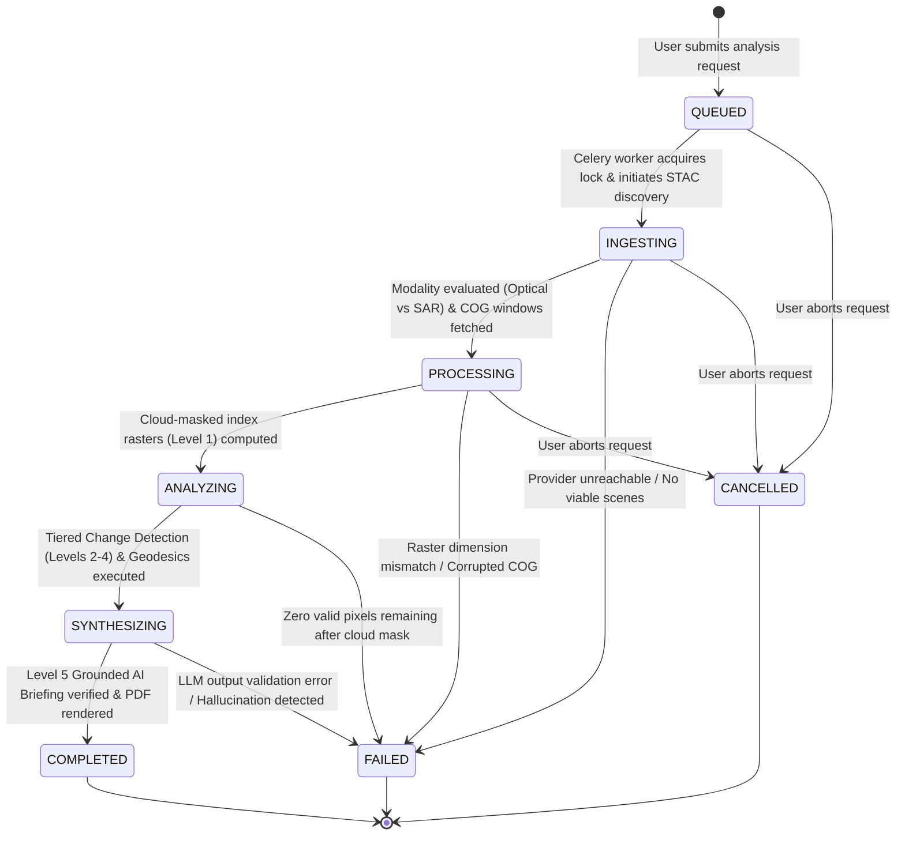

# ORBIT Architecture: Analysis Pipeline & Worker State Machine

## 1. Analysis Lifecycle State Machine

Analysis runs transition through a deterministic, strictly monitored lifecycle state machine:



---

## 2. Tiered Change Detection Execution & Worker Topology

Celery workers are partitioned into specialized queues to isolate heavy raster processing from lightweight geocoding and report generation:

```
+-----------------------------------------------------------------------------------+
| QUEUE 1: `celery_fast` (Concurrency: 8 workers)                                   |
| - Location geocoding & gazetteer resolution                                        |
| - STAC catalog search and modality suitability evaluation                         |
| - Dynamic MVT tile generation cache warmups                                       |
+-----------------------------------------------------------------------------------+

+-----------------------------------------------------------------------------------+
| QUEUE 2: `celery_raster` (Concurrency: 4 workers, High-Memory / NumPy Optimized)   |
| - HTTP Range windowed COG tile reads                                              |
| - Tier 1: Radiometric band math (NDVI, NDWI, NDBI) and SCL cloud masking          |
| - Tier 2: Bi-temporal differencing, Otsu baseline, CCDC harmonic modeling         |
| - Tier 3: Morphological segmentation and object extraction                        |
+-----------------------------------------------------------------------------------+

+-----------------------------------------------------------------------------------+
| QUEUE 3: `celery_intel` (Concurrency: 4 workers)                                  |
| - Tier 4: PostGIS spatial clustering (ST_ClusterDBSCAN) & geodesic ST_Area        |
| - Evidence Strength ($ESI$) evaluation and cryptographic SHA-256 DAG recording    |
| - Tier 5: Grounded LLM narrative synthesis + Anti-hallucination validation gate   |
| - WeasyPrint / ReportLab PDF compilation and artifact packaging                   |
+-----------------------------------------------------------------------------------+
```
