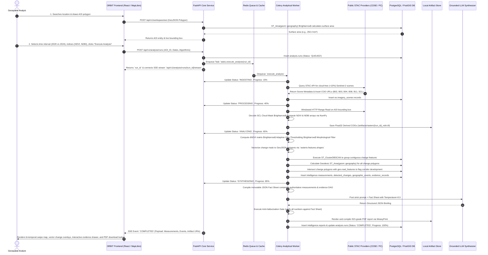

# ORBIT Architecture: End-to-End Data Flow & Interaction Sequences

## 1. Complete End-to-End Pipeline Sequence

This diagram details the full lifecycle of an investigation from user location query to final intelligence report generation:

