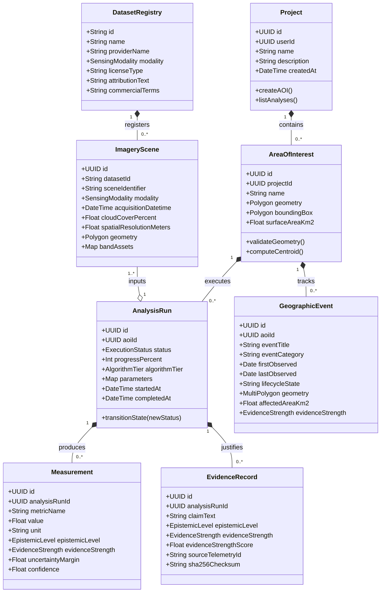

# ORBIT Architecture: Domain-Driven Design (DDD) & Object Model

## 1. Domain Aggregates & Entity Relationships

ORBIT enforces strict Domain-Driven Design boundaries across its core aggregates:

---

## 2. Value Objects & Value Types

1. **`EvidenceStrength`**:
   - Categorical Value Object (`STRONG`, `MODERATE`, `LIMITED`, `INSUFFICIENT`) determined deterministically via the $ESI$ composite formula.
2. **`SensingModality`**:
   - Value Type (`OPTICAL_MULTISPECTRAL`, `SAR_MICROWAVE`, `HYBRID_FUSION`) defining sensory physics.
3. **`HistoricalEpoch`**:
   - Value Object bundling temporal bounds, sensor capabilities, and support classifications (`STRONGLY_SUPPORTED`, `PARTIALLY_SUPPORTED`, `ESTIMATED`, `UNAVAILABLE`).
4. **`GeodesicArea`**:
   - Immutable spatial scalar calculated via PostGIS `ST_Area(geom::geography)`.
