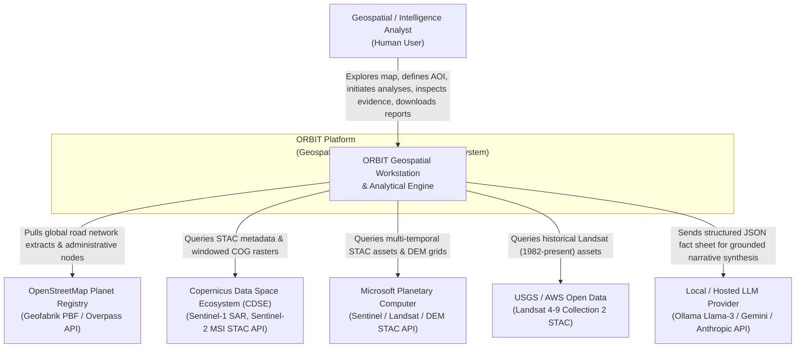
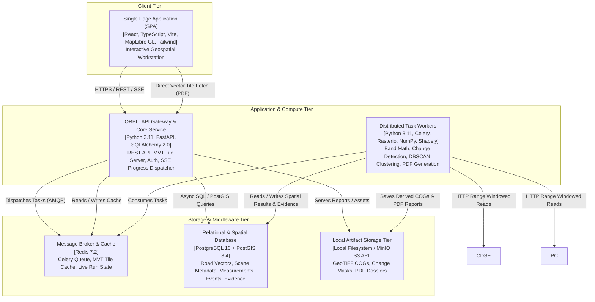

# ORBIT Architecture: System Context & Container Specifications (C4 Model)

## 1. System Context Diagram (C4 Level 1)

The System Context diagram illustrates how ORBIT interacts with external users, planetary satellite archives, and vector map registries:

---

## 2. Container Diagram (C4 Level 2)

The Container diagram decomposes ORBIT into deployable application units, storage repositories, and background queues:

