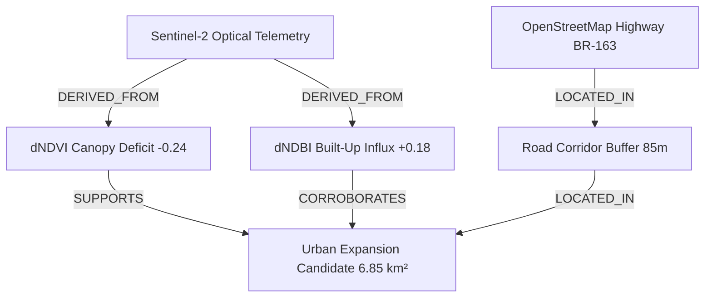

# ORBIT Phase 11 — Advanced Geospatial Intelligence & Evidence System

## 1. Architectural Blueprint & Epistemic Hierarchy

ORBIT (Geospatial Intelligence & Earth Monitoring Platform) Phase 11 establishes a deterministic, multi-indicator spatial intelligence engine grounded in mathematical provenance, cryptographic checksums, and explicit evidence graphs.

```
+-----------------------------------------------------------------------------+
|                           ORBIT Epistemic Hierarchy                         |
+-----------------------------------------------------------------------------+
| Level 1: OBSERVED           | Raw sensor telemetry, Sentinel/Landsat STAC   |
|                             | scenes, OpenStreetMap road vector registry     |
| Level 2: CALCULATED         | Spectral indices (NDVI, NDWI, NDBI), pixel    |
|                             | change masks, geodesic surface areas (km²)    |
| Level 3: DETECTED           | Discrete multi-indicator intelligence events, |
|                             | spatial corridor clearing, urban expansion    |
| Level 4: HISTORICAL         | Multi-decadal empirical summaries (1984-2024) |
| Level 5: PREDICTED          | Scenario-bounded future models (2027-2050)    |
+-----------------------------------------------------------------------------+
```

### Epistemic Invariants:
1. **Separation of Fact and Forecast**: Intelligence objects generated in Phase 11 are strictly classified as `CALCULATED` or `DETECTED`. They are never marked `OBSERVED` (raw data only) or conflated with `PREDICTED` (future projections).
2. **Deterministic Processing**: All intelligence rules, threshold classifications, and graph linkages execute deterministically without LLM hallucinations or generative AI interpolation.
3. **Evidence Strength Aggregation**:
   - `STRONG`: 2+ concordant authoritative observations/indices with cryptographic checksums.
   - `MODERATE`: 1 authoritative observation or 2 moderate sources.
   - `LIMITED`: Single lower-confidence indicator.
   - `INSUFFICIENT`: Ambiguous, noisy, or cross-sensor contradictory observations.

---

## 2. Deterministic Intelligence Rules

| Rule Identifier | Trigger Conditions | Intelligence Classification | Default Confidence |
| :--- | :--- | :--- | :--- |
| `RULE_MULTI_URBAN_EXPANSION_v1` | $dNDVI \le -0.10 \land dNDBI \ge +0.08 \land \text{Same AOI \& Window}$ | `URBAN_EXPANSION` | 0.94 |
| `RULE_INFRASTRUCTURE_CORRIDOR_v1` | $dNDVI \le -0.10 \land \text{Road Distance} \le 500\text{m}$ | `INFRASTRUCTURE_CHANGE` | 0.92 |
| `RULE_WATER_CHANGE_v1` | $|dNDWI| \ge 0.10$ | `WATER_CHANGE` | 0.96 |
| `RULE_VEGETATION_CHANGE_v1` | $|dNDVI| \ge 0.10 \land |dNDBI| < 0.08$ | `VEGETATION_CHANGE` | 0.90 |
| `RULE_CONTRADICTION_DETECTION_v1` | Cross-sensor polarity divergence (e.g. Optical loss vs SAR stable) | `CONTRADICTED` | 0.50 |

---

## 3. Evidence Graph Architecture

The evidence graph links foundational sensors, measurements, and vector registries to high-level intelligence objects through directed edges:

### Edge Relationship Types:
- `DERIVED_FROM`: Direct lineage from sensor or raster calculation.
- `SUPPORTS`: Confirmatory evidence directly indicating the change event.
- `CORROBORATES`: Independent secondary indicator agreeing with the claim.
- `CONTRADICTS`: Divergent signal (e.g. radar vs optical) flagged explicitly in the graph.
- `LOCATED_IN`: Spatial inclusion or road corridor intersection.
- `TEMPORALLY_ALIGNS`: Validated temporal interval alignment within 45 days tolerance.



---

## 4. Contradictory Evidence Preservation

Contradictory observations are **never** averaged away or discarded:
- An explicit edge `CONTRADICTS` is attached between conflicting nodes.
- The overall intelligence status is set to `CONTRADICTED`.
- Evidence strength is downgraded to `INSUFFICIENT`.
- Both conflicting data streams and their parameters are preserved in the DAG for analyst review.

---

## 5. PostgreSQL/PostGIS Schema & Alembic Migration 0006

### Schema Additions (`intelligence` schema):
1. `intelligence.intelligence_events`:
   - `id`: UUID (PK)
   - `analysis_run_id`: UUID (FK `analysis.runs.id`)
   - `area_of_interest_id`: UUID (FK `workspace.areas_of_interest.id`)
   - `intelligence_type`: VARCHAR(100)
   - `title`: VARCHAR(255)
   - `geometry`: Geometry(MULTIPOLYGON, 4326) with GiST index
   - `affected_area`: FLOAT (km²)
   - `start_date`, `end_date`: TIMESTAMPTZ
   - `evidence_strength`: Enum `intelligence.evidence_strength`
   - `epistemic_level`: Enum `intelligence.epistemic_level`
   - `confidence`: FLOAT (0.0 to 1.0)
   - `rule_id`, `rule_version`, `algorithm_version`: VARCHAR
   - `quality_metadata`, `provenance`: JSONB
   - `status`: VARCHAR(50)

2. `intelligence.evidence_relationships`:
   - `id`: UUID (PK)
   - `source_evidence_id`: UUID (FK `intelligence.evidence_records.id`)
   - `target_entity_type`: VARCHAR(50)
   - `target_entity_id`: VARCHAR(255)
   - `relationship_type`: VARCHAR(50)
   - `weight`: FLOAT
   - `metadata_payload`: JSONB

---

## 6. REST API Endpoints

- `POST /api/v1/intelligence/analyze`: Execute deterministic rule evaluation, spatial/temporal correlation, and return structured intelligence object with evidence graph.
- `GET /api/v1/intelligence/events`: Query intelligence events with filtering by `intelligence_type`, `evidence_strength`, and pagination.
- `GET /api/v1/intelligence/{id}`: Retrieve single intelligence object.
- `GET /api/v1/intelligence/{id}/evidence`: Retrieve supporting evidence records.
- `GET /api/v1/intelligence/{id}/provenance`: Retrieve complete calculation trace and cryptographic signatures.
- `GET /api/v1/intelligence/{id}/relationships`: Retrieve evidence graph relationship edges.
- `POST /api/v1/intelligence/evidence/query`: Query evidence records with source/claim filters.

---

## 7. Frontend Workstation Integration

The ORBIT Workstation Shell includes:
- **Advanced Intelligence Panel**: Multi-event selector and interactive sub-tabs (`Overview`, `Evidence Graph`, `Records`, `Spatial Context`, `Trace`).
- **Interactive Graph Visualizer (`RelationshipGraphView`)**: Visual node-link DAG rendering node epistemic tiers, relationship types, and contradiction warning banners.
- **Infrastructure & Temporal Context Cards**: Real-time road distance and temporal interval inspector.
