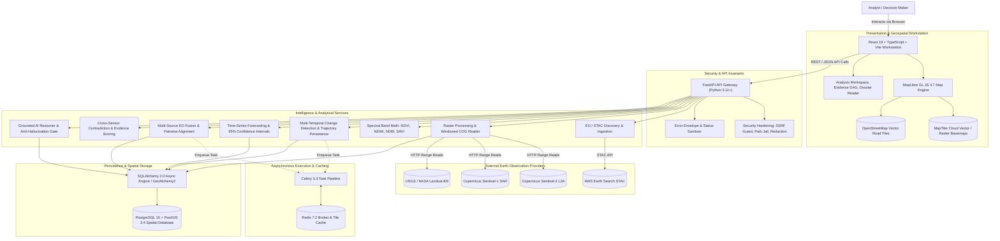

# ORBIT System Architecture

## 1. Master System Architecture Diagram

The diagram below illustrates the end-to-end data flow, processing pipeline, and structural separation of concerns across the ORBIT platform:



---

## 2. Layer-by-Layer Architectural Decomposition

### 2.1 Presentation & Geospatial Workstation Layer
- **Core Technologies**: React 18, TypeScript, Vite, MapLibre GL JS 4.7, Tailwind CSS, Lucide Icons.
- **Role**: Provides a high-performance, browser-based geospatial workstation for visual intelligence, bounding-box AOI selection, multi-temporal footprint overlays, raster difference masks, and road corridor analysis.
- **Basemap Engine**: MapLibre GL rendering vector and raster basemaps sourced from MapTiler Cloud with seamless fallback to OpenStreetMap cartographic styles.
- **Coordinate Precision**: Real-time geodesic tracking and coordinate formatting in WGS84 (`EPSG:4326`) and Web Mercator (`EPSG:3857`).

### 2.2 Security Hardening & API Gateway Layer
- **Core Technologies**: FastAPI 0.110+, Pydantic v2, Pydantic Settings, Python 3.11+.
- **SSRF Protection**: Strict IP filtering rejecting loopback (`127.0.0.0/8`), RFC 1918 private subnets (`10.0.0.0/8`, `172.16.0.0/12`, `192.168.0.0/16`), link-local/cloud metadata endpoints (`169.254.169.254`), and non-HTTP schemes.
- **Path Traversal Defense**: Normalization and jail enforcement preventing directory escape outside project boundaries.
- **Memory Caps**: 256 MB allocation limits and 16,384 x 16,384 pixel caps preventing raster decompression denial-of-service.
- **Credential Redaction**: Automatic scrubbing of tokens, passwords, and connection strings from error envelopes and log events.

### 2.3 Earth Observation Discovery & Ingestion
- **STAC Querying**: Direct querying of the AWS Earth Search (Element84) STAC API cataloging Sentinel-2, Sentinel-1, and Landsat scenes.
- **Deterministic Scene Ranking**: Multi-criteria ranking scoring scenes based on cloud cover percentage, temporal proximity to target target date, ground sample distance (GSD), and spatial Intersection-over-Union (IoU) with the user-defined Area of Interest (AOI).

### 2.4 Raster Processing & Spectral Analytics Subsystem
- **Windowed Cloud-Optimized GeoTIFF (COG) Reads**: Windowed pixel extraction via `rasterio` reading only requested bounding box extents rather than downloading full gigabyte scenes.
- **Pre-Analytical Validation**: Fast GeoTIFF header verification validating TIFF magic bytes, CRS non-degeneracy, affine transform integrity, and SHA-256 asset checksums before computational processing.
- **Spectral Index Engine**: Deterministic calculation of normalized indices:
  - **NDVI** (Normalized Difference Vegetation Index): $\frac{\text{NIR} - \text{Red}}{\text{NIR} + \text{Red}}$
  - **NDWI** (Normalized Difference Water Index): $\frac{\text{Green} - \text{NIR}}{\text{Green} + \text{NIR}}$
  - **NDBI** (Normalized Difference Built-up Index): $\frac{\text{SWIR} - \text{NIR}}{\text{SWIR} + \text{NIR}}$
  - **SAVI** (Soil-Adjusted Vegetation Index): $\frac{(\text{NIR} - \text{Red})(1 + L)}{\text{NIR} + \text{Red} + L}$ ($L = 0.5$)
- **Masking**: Cloud confidence masking, SCL (Scene Classification Layer) filtering, and dynamic NoData exclusion.

### 2.5 Multi-Temporal Change Detection & Trajectory Persistence
- **Bi-Temporal & Sequential Change**: Calculates pixel-level and vector-level transitions across consecutive observation timestamps ($T_1 \to T_2 \to \dots \to T_n$).
- **Directional Persistence**: Quantifies whether canopy loss, water recession, or urban expansion represents sustained structural change, seasonal oscillation, or post-disturbance recovery/rebound.
- **Geodesic Spatial Metrics**: Exact area computation in square kilometers and hectares using PostGIS spheroid geography functions (`ST_Area(geog, true)`).

### 2.6 Multi-Source EO Fusion & Cross-Sensor Contradiction Engine
- **Pairwise Multi-Modal Alignment**: Aligns optical imagery (Sentinel-2), radar backscatter (Sentinel-1 SAR C-band), and OpenStreetMap vector road networks across spatial tolerance and time windows.
- **Contradiction Evaluation**: Detects and reports conflicting sensor signals (e.g., optical greenness drop contradicted by high SAR structural backscatter indicating standing trees) without consensus averaging or discarding data.
- **Evidence Strength Scoring**: Deterministic multi-criteria scoring combining spatial resolution, cloud penalty, sensor corroboration bonuses, and contradiction penalties.

### 2.7 Time-Series Forecasting Engine
- **Predictive Modeling**: Trend regression and harmonic decomposition over historical observation trajectories.
- **Uncertainty Quantification**: Strict computation of $\pm 95\%$ confidence interval bounds ($p < 0.01$) alongside historical out-of-sample backtesting metrics (RMSE, $R^2$).
- **Strict Epistemic Isolation**: Prevents future projections from being labeled or queried as observed factual data.

### 2.8 Grounded AI Reasoner & Anti-Hallucination Gate
- **Claim-Level Evidence Graph**: Requires every declarative sentence or finding in generated intelligence dossiers to cite an underlying deterministic evidence ID.
- **Epistemic Validation Gate**: Rejects ungrounded claims, speculative generalizations, or statements exceeding observational certainty tiers.
- **Cryptographic Provenance**: Computes canonical SHA-256 digests over observation inputs, intermediate calculation tables, and final report dossiers.

### 2.9 Persistence & Database Layer
- **PostgreSQL 16 + PostGIS 3.4**: Relational and spatial data persistence organized across 7 dedicated schemas: `auth`, `workspace`, `geo`, `eo`, `analysis`, `intelligence`, `history_deep`.
- **Alembic Migrations**: Fully managed, reversible migration revisions (`0001` through `0010_multi_source_fusion`).

---

## 3. Data Flow & Security Boundaries

```
[External Web / STAC]
         │ (HTTPS / SSRF Filtering)
         ▼
[Ingestion & Validation] ─── (SHA-256 Checksum) ───► [Local Asset Cache]
         │
         ▼
[Windowed Spectral Engine] ── (Deterministic Band Math)
         │
         ▼
[Change & Fusion Pipeline] ── (Pairwise Alignment & Corroboration)
         │
         ▼
[Evidence Graph DAG] ────── (Immutable Lineage Digest)
         │
         ▼
[Grounded AI Reasoner] ─── (Anti-Hallucination Validation Gate)
         │
         ▼
[Signed Intelligence Dossier] ──► [On-Screen / PDF / Markdown Export]
```
